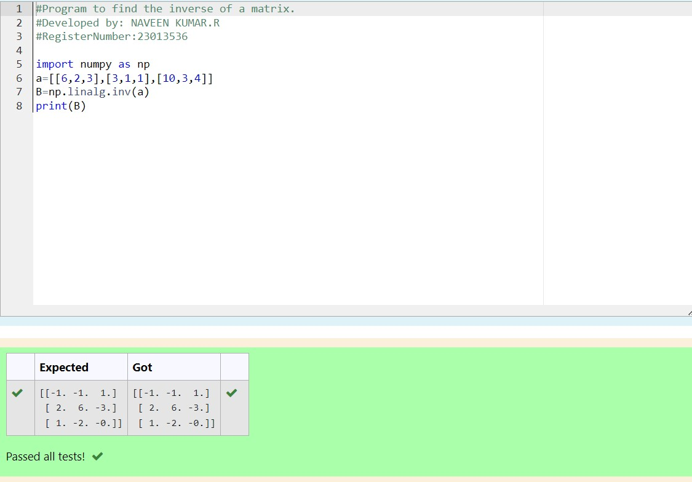

# INVERSE-OF-A-MATRIX
## Aim:
To write a python program to find the inverse of a matrix
## Equipment’s required:
1. 	Hardware – PCs
2. 	Anaconda – Python 3.7 Installation / Moodle-Code Runner
## Algorithm:
## Step1 :
Import numpy as convienience variable

## Step 2:
Let assume any variable

## Step 3:
Using the np.linalg.matrix_rank(),we can find the rankof the given matrix

## Step 4:
print result

## Program:
```
#Program to find the inverse of a matrix.
#Developed by: NAVEEN KUMAR.R
#RegisterNumber:23013536

import numpy as np
a=[[6,2,3],[3,1,1],[10,3,4]]
B=np.linalg.inv(a)
print(B)
```
## Output:

## Result:
Thus the inverse of given matrix is successfully solved using python program

